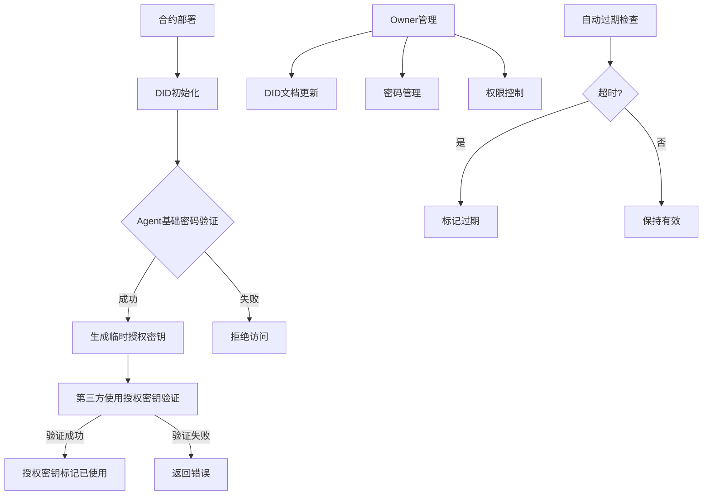
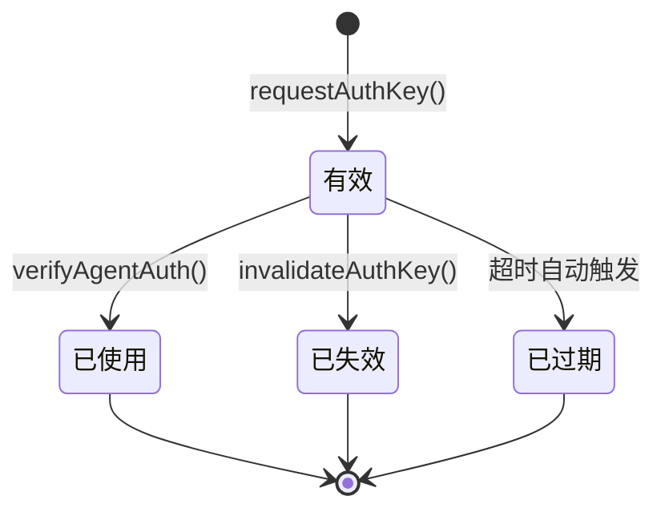

# Agent DID 智能合约功能需求文档

## 1. 合约概述

基于以太坊的Agent身份管理和DID（去中心化身份）智能合约，实现AI Agent的身份认证、授权密钥管理和权限控制功能。

- 核心目标：为AI Agent提供去中心化的身份管理和安全的授权机制
- 技术标准：遵循DID标准(did:ethr格式)，采用Keccak256哈希算法确保安全性
- 部署环境：以太坊主网/测试网，使用Solidity 0.8.19+版本开发

## 2. 智能合约功能模块

### 2.1 角色权限定义

| 角色 | 身份验证方式 | 合约权限 |
|------|-------------|----------|
| Owner | msg.sender == owner | 全部管理权限：DID文档管理、密码管理、所有权转移、紧急控制 |
| Agent | 密码哈希验证 | 授权密钥生成、密钥失效、DID文档查询 |
| 第三方应用 | 无需验证 | 身份验证、DID文档查询 |
| 公开访问 | 无需验证 | DID文档查询（只读） |

### 2.2 核心功能模块

智能合约包含五个核心功能模块：

1. **模块一：DID文档管理** - 合约部署初始化、文档字段更新、公开查询
2. **模块二：授权密钥管理** - 密钥生成、验证、失效、自动过期
3. **模块三：密码管理** - 密码修改、重置、哈希验证
4. **模块四：权限控制** - 所有权转移、紧急暂停、参数配置
5. **模块五：异常与边界处理** - 权限拦截、防暴力破解、失效密钥处理

### 2.3 功能详细规范

| 功能模块 | 函数名称 | 功能描述 | 权限要求 | 关键逻辑 |
|----------|----------|----------|----------|----------|
| DID文档管理 | constructor | 合约部署初始化，生成DID标识，设置Owner和Agent基本信息 | 部署者 | 自动生成did:ethr:{chainId}:{contractAddress}格式DID，接收初始Agent密码明文并计算Keccak256哈希存储 |
| DID文档管理 | updateDIDDocField | 更新单个DID文档字段，优化gas消耗 | onlyOwner | 字段名白名单验证，单字段更新 |
| DID文档管理 | updateDIDDocument | 全量更新DID文档所有字段 | onlyOwner | 清空原字段，批量写入新字段 |
| DID文档管理 | getDIDDocument | 查询完整DID文档信息 | 公开访问 | 返回所有字段的键值对 |
| DID文档管理 | getDIDDocField | 查询单个DID文档字段 | 公开访问 | 返回指定字段值 |
| 授权密钥管理 | requestAuthKey | Agent使用密码生成临时授权密钥 | 密码验证+whenNotPaused | Agent密码哈希验证，旧授权密钥失效，生成新授权密钥哈希 |
| 授权密钥管理 | verifyAgentAuth | 第三方验证Agent身份 | whenNotPaused | 密钥哈希匹配，状态检查，验证后标记已使用 |
| 授权密钥管理 | invalidateAuthKey | Agent主动失效授权密钥 | 密码验证+whenNotPaused | Agent密码验证，授权密钥状态改为已失效 |
| 授权密钥管理 | _checkKeyExpiry | 内部函数检查授权密钥过期 | 内部调用 | 时间戳比较，自动标记授权密钥过期状态 |
| 密码管理 | updateAgentPassword | 修改Agent基础密码（需旧密码） | onlyOwner | 旧Agent密码验证，新Agent密码哈希存储，所有授权密钥失效 |
| 密码管理 | resetAgentPassword | 重置Agent基础密码（忘记旧密码） | onlyOwner | 直接重置Agent密码哈希，所有授权密钥失效 |
| 权限控制 | transferOwnership | 发起所有权转移 | onlyOwner | 设置pendingOwner，记录发起时间 |
| 权限控制 | acceptOwnership | 确认所有权转移 | pendingOwner | 72小时内确认，更新owner |
| 权限控制 | emergencyPause | 紧急暂停合约 | onlyOwner | 设置isPaused=true，禁用关键功能 |
| 权限控制 | emergencyUnpause | 恢复合约运行 | onlyOwner | 设置isPaused=false，恢复功能 |
| 权限控制 | updateAuthKeyExpiry | 修改密钥有效期 | onlyOwner | 更新authKeyExpiryTime参数 |
| 异常边界处理 | _checkOwnerPermission | 内部权限检查函数 | 内部调用 | 验证msg.sender == owner，非Owner直接拒绝 |
| 异常边界处理 | _handlePasswordError | 密码错误处理函数 | 内部调用 | 计数错误次数，超过5次锁定1小时 |
| 异常边界处理 | _validateKeyStatus | 密钥状态验证函数 | 内部调用 | 检查密钥状态，拒绝失效/过期/已使用密钥 |

## 3. 智能合约执行流程

### 3.1 核心业务流程

**合约部署与初始化流程：**
1. Owner部署合约 → 2. 自动生成DID标识 → 3. 初始化Agent基本信息 → 4. 设置预设Agent密码哈希 → 5. 设置默认参数

**授权密钥生命周期流程：**
1. Agent使用基础密码验证 → 2. 生成新授权密钥哈希 → 3. 失效旧授权密钥 → 4. 第三方使用授权密钥验证 → 5. 授权密钥标记已使用/过期

**权限管理流程：**
1. Owner发起转移 → 2. 设置待确认状态 → 3. 新Owner确认 → 4. 完成所有权转移

### 3.2 状态转换图

**授权密钥状态转换：**

## 4. 安全要求与约束

### 4.1 安全机制
- **密码安全**：Agent基础密码和授权密钥均采用Keccak256哈希存储，明文不上链
- **密钥概念分离**：Agent基础密码用于身份认证，授权密钥用于临时验证，两者完全独立
- **授权密钥唯一性**：同一时间仅允许一个有效授权密钥，防止多密钥冲突
- **防重放攻击**：授权密钥验证后立即标记为已使用，禁止重复验证
- **权限隔离**：严格的修饰符控制，确保只有授权角色可执行相应操作
- **应急机制**：紧急暂停功能，可快速停止关键操作防止损失扩大

### 4.2 Gas优化策略
- **存储优化**：使用mapping存储DID字段，支持部分更新减少写入操作
- **批量限制**：设置maxBatchSize参数，防止单次操作gas消耗过高
- **事件记录**：关键操作触发事件，便于链下监听和状态同步

### 4.3 业务约束
- **授权密钥有效期**：默认24小时，可由Owner调整适配业务需求
- **Agent基础密码**：部署时传入明文，合约计算Keccak256哈希存储，明文不上链
- **所有权转移**：72小时确认期，防止误操作和恶意转移
- **字段白名单**：DID文档字段限制在预设白名单内，防止无效数据写入
- **密码错误限制**：最多允许5次Agent基础密码错误，超过后锁定1小时防暴力破解
- **权限严格控制**：所有修改操作仅限Owner执行，非Owner请求直接拒绝

## 5. 模块五：异常与边界处理详细规范

### 5.1 场景14：非Owner权限拦截

**功能描述**：防止非Owner用户调用Owner专属函数，确保权限安全

**触发条件**：非Owner用户调用updateDIDDocument、updateAgentPassword、transferOwnership等Owner专属接口

**处理逻辑**：
1. 在所有Owner专属函数中使用onlyOwner修饰符
2. 修饰符内部检查msg.sender == owner
3. 不匹配时立即抛出OnlyOwner()错误，终止执行
4. 不产生任何状态变更，不消耗额外gas

**返回结果**：抛出OnlyOwner()自定义错误

### 5.2 场景15：防暴力破解机制

**功能描述**：防止恶意用户通过多次尝试破解Agent密码

**触发条件**：Agent在requestAuthKey或invalidateAuthKey时连续输入错误的基础密码

**处理逻辑**：
1. 维护passwordErrorCount计数器记录Agent基础密码错误次数
2. 每次Agent基础密码验证失败时递增计数器
3. 错误次数≤5次：返回密码错误提示，允许继续尝试
4. 错误次数>5次：设置passwordLockedUntil = 当前时间 + 3600秒
5. 锁定期间拒绝所有Agent基础密码相关操作，返回锁定提示
6. 锁定期过后自动解锁，重置错误计数

**状态变更**：
- passwordErrorCount：记录连续错误次数
- passwordLockedUntil：记录锁定截止时间戳

**返回结果**：
- 错误≤5次：返回"Agent基础密码错误，请重试"
- 错误>5次：返回"Agent基础密码错误次数过多，已锁定1小时"

### 5.3 场景16：失效授权密钥验证拦截

**功能描述**：防止第三方使用已失效、过期或已使用的授权密钥进行身份验证

**触发条件**：第三方调用verifyAgentAuth时传入非有效状态的授权密钥

**处理逻辑**：
1. 在授权密钥验证前先检查authKeyInfo.status状态
2. 检查授权密钥是否过期：当前时间 - generateTime > authKeyExpiryTime
3. 仅允许状态为VALID且未过期的授权密钥进行验证
4. 失效授权密钥直接拒绝，不进行哈希比较，节省gas

**状态变更**：无（仅读取状态，不修改）

**返回结果**：
- 状态为USED：返回"授权密钥已使用，验证失败"
- 状态为EXPIRED：返回"授权密钥已过期，验证失败"  
- 状态为INVALIDATED：返回"授权密钥已失效，验证失败"