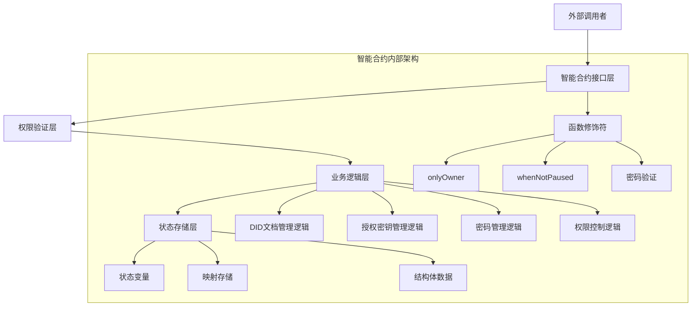
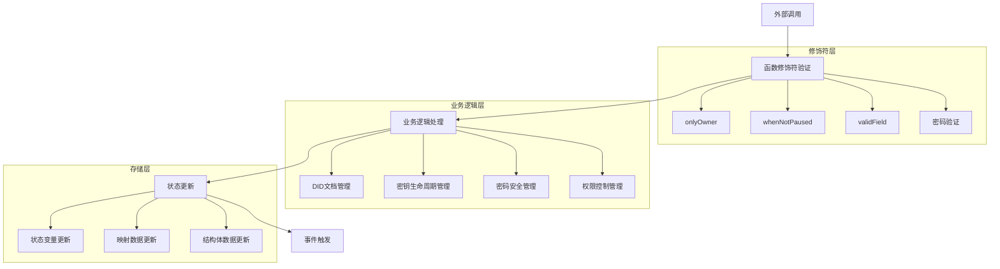
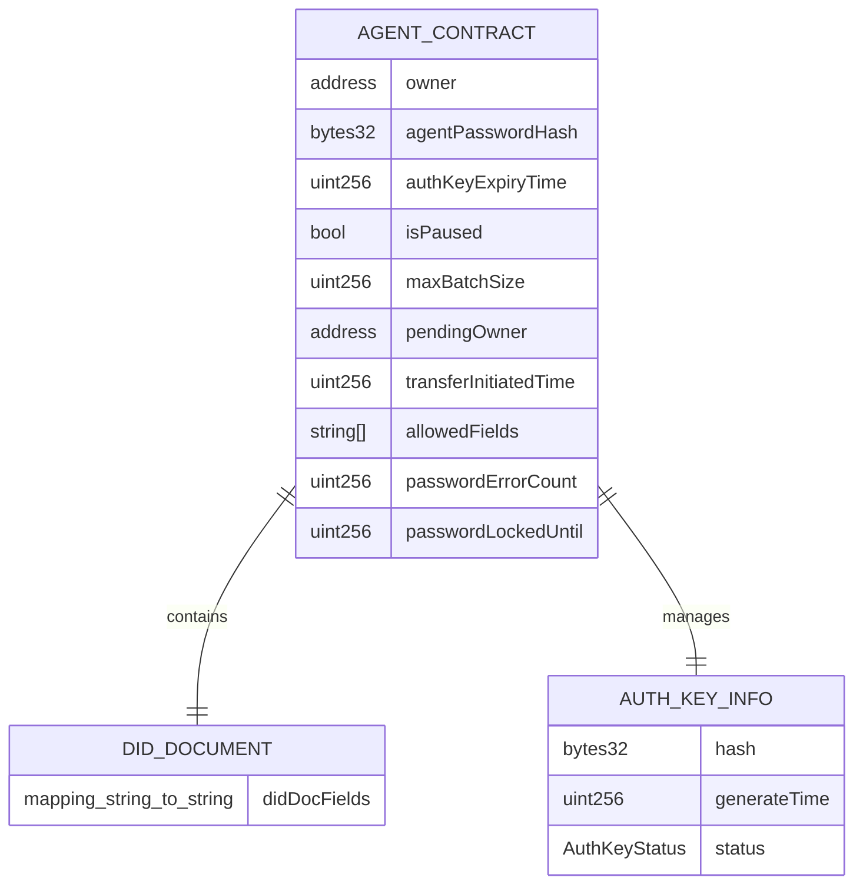

# Agent DID 智能合约技术架构文档

**文档信息**
- **作者**: Qianniming
- **版本**: 1.0.0
- **日期**: 2025年10月30日
- **许可证**: Apache License 2.0

## 1. 智能合约架构设计



## 2. 技术栈与开发环境

* **智能合约语言**：Solidity ^0.8.19

* **开发框架**：Hardhat

* **安全库**：OpenZeppelin Contracts

* **测试框架**：Hardhat + Chai + Ethers.js

* **部署网络**：以太坊主网/Goerli测试网/Sepolia测试网

* **编译器**：solc 0.8.19+

## 3. 智能合约接口定义

### 3.1 主要函数接口

| 函数名                   | 可见性      | 修饰符           | 功能描述                                        |
| --------------------- | -------- | ------------- | ------------------------------------------- |
| constructor           | public   | -             | 合约部署初始化，接收Agent基本信息和初始密码明文，计算密码哈希存储，生成DID标识 |
| updateDIDDocField     | external | onlyOwner     | 更新单个DID文档字段                                 |
| updateDIDDocument     | external | onlyOwner     | 全量更新DID文档                                   |
| getDIDDocument        | external | view          | 查询完整DID文档                                   |
| getDIDDocField        | external | view          | 查询单个DID字段                                   |
| requestAuthKey        | external | whenNotPaused | Agent使用基础密码生成临时授权密钥                         |
| verifyAgentAuth       | external | whenNotPaused | 第三方使用授权密钥验证Agent身份                          |
| invalidateAuthKey     | external | whenNotPaused | Agent主动失效授权密钥                               |
| updateAgentPassword   | external | onlyOwner     | 修改Agent基础密码（需旧密码）                           |
| resetAgentPassword    | external | onlyOwner     | 重置Agent基础密码（忘记旧密码）                          |
| transferOwnership     | external | onlyOwner     | 发起所有权转移                                     |
| acceptOwnership       | external | -             | 确认接受所有权                                     |
| emergencyPause        | external | onlyOwner     | 紧急暂停合约                                      |
| emergencyUnpause      | external | onlyOwner     | 恢复合约运行                                      |
| updateAuthKeyExpiry   | external | onlyOwner     | 修改密钥有效期                                     |
| \_checkPasswordLock   | internal | -             | 检查Agent基础密码锁定状态                             |
| \_handlePasswordError | internal | -             | 处理Agent基础密码错误计数和锁定                          |
| \_validateKeyStatus   | internal | -             | 验证授权密钥状态是否有效                                |

### 3.2 函数参数详细定义

**DID文档管理函数**

```solidity
function updateDIDDocField(string memory fieldName, string memory newValue) external onlyOwner validField(fieldName)
function updateDIDDocument(string[] memory fields, string[] memory values) external onlyOwner
function getDIDDocument() external view returns (string[] memory fields, string[] memory values)
function getDIDDocField(string memory fieldName) external view returns (string memory)
```

**授权密钥管理函数**

```solidity
function requestAuthKey(string memory agentPassword) external whenNotPaused returns (bool)  // Agent使用基础密码生成临时授权密钥
function verifyAgentAuth(string memory authKey) external whenNotPaused returns (bool)      // 第三方使用授权密钥验证Agent身份
function invalidateAuthKey(string memory agentPassword) external whenNotPaused returns (bool) // Agent主动失效授权密钥
```

**Agent基础密码管理函数**

```solidity
function updateAgentPassword(string memory oldPassword, string memory newPassword) external onlyOwner  // 修改Agent基础密码（需旧密码）
function resetAgentPassword(string memory newPassword) external onlyOwner                              // 重置Agent基础密码（忘记旧密码）
```

**权限控制函数**

```solidity
function transferOwnership(address newOwner) external onlyOwner
function acceptOwnership() external
function emergencyPause() external onlyOwner
function emergencyUnpause() external onlyOwner
function updateAuthKeyExpiry(uint256 newExpiryTime) external onlyOwner
```

**异常与边界处理内部函数**

```solidity
function _checkPasswordLock() internal view returns (bool)    // 检查Agent基础密码锁定状态
function _handlePasswordError() internal                      // 处理Agent基础密码错误计数和锁定
function _validateKeyStatus() internal view returns (bool)    // 验证授权密钥状态是否有效
```

### 3.3 事件定义

```solidity
event DIDDocumentUpdated(string indexed fieldName, string newValue);
event DIDDocumentBatchUpdated(string[] fields, string[] values);
event AuthKeyGenerated(address indexed agent, uint256 generateTime);
event AuthKeyVerified(address indexed verifier, address indexed agent, bool success);
event AuthKeyInvalidated(address indexed agent, uint256 invalidateTime);
event AgentPasswordUpdated(address indexed owner, uint256 updateTime);
event AgentPasswordReset(address indexed owner, uint256 resetTime);
event OwnershipTransferInitiated(address indexed previousOwner, address indexed newOwner, uint256 initiateTime);
event OwnershipTransferred(address indexed previousOwner, address indexed newOwner);
event ContractPaused(address indexed owner, uint256 pauseTime);
event ContractUnpaused(address indexed owner, uint256 unpauseTime);
event AuthKeyExpiryUpdated(uint256 oldExpiry, uint256 newExpiry);
event AgentPasswordErrorOccurred(address indexed caller, uint256 errorCount);
event AgentPasswordLocked(address indexed caller, uint256 lockedUntil);
event UnauthorizedAccess(address indexed caller, string functionName);
```

### 3.4 错误定义

```solidity
error OnlyOwner();
error ContractPaused();
error InvalidAgentPassword();
error InvalidAuthKey();
error AuthKeyExpired();
error AuthKeyAlreadyUsed();
error InvalidFieldName();
error OwnershipTransferNotInitiated();
error OwnershipTransferExpired();
error NotPendingOwner();
error ArrayLengthMismatch();
error AgentPasswordLocked();
error TooManyAgentPasswordErrors();
error InvalidAuthKeyStatus();
```

## 4. 智能合约内部架构



## 5. 数据模型与存储结构

### 5.1 智能合约数据模型



### 5.2 枚举类型定义

```solidity
enum AuthKeyStatus {
    VALID,      // 有效
    USED,       // 已使用
    EXPIRED,    // 已过期
    INVALIDATED // 已失效
}
```

### 5.3 完整状态变量定义

```solidity
// SPDX-License-Identifier: MIT
pragma solidity ^0.8.19;

contract AgentDID {
    // ============ 状态变量 ============
    
    // 基础权限控制
    address public owner;                    // 合约所有者
    bytes32 private agentPasswordHash;       // Agent基础密码哈希（部署时计算）
    
    // DID文档存储
    mapping(string => string) public didDocFields;  // DID文档字段映射
    string[] public allowedFields;           // 允许的字段白名单
    
    // 授权密钥管理
    struct AuthKeyInfo {
        bytes32 hash;                        // 密钥哈希
        uint256 generateTime;                // 生成时间戳
        AuthKeyStatus status;                // 密钥状态
    }
    AuthKeyInfo public authKeyInfo;          // 当前授权密钥信息
    
    // 系统配置参数
    uint256 public authKeyExpiryTime;        // 密钥有效期（秒）
    bool public isPaused;                    // 合约暂停状态
    uint256 public maxBatchSize;             // 批量操作上限
    
    // 所有权转移
    address public pendingOwner;             // 待确认的新所有者
    uint256 public transferInitiatedTime;    // 转移发起时间
    uint256 public constant TRANSFER_TIMEOUT = 72 hours; // 转移确认超时时间
    
    // 异常与边界处理
    uint256 public passwordErrorCount;       // 密码错误次数计数
    uint256 public passwordLockedUntil;      // 密码锁定截止时间
    uint256 public constant MAX_PASSWORD_ERRORS = 5; // 最大密码错误次数
    uint256 public constant LOCK_DURATION = 3600; // 锁定时长（1小时）
    
    // ============ 修饰符定义 ============
    
    modifier onlyOwner() {
        if (msg.sender != owner) revert OnlyOwner();
        _;
    }
    
    modifier whenNotPaused() {
        if (isPaused) revert ContractPaused();
        _;
    }
    
    modifier validField(string memory fieldName) {
        bool isValid = false;
        for (uint i = 0; i < allowedFields.length; i++) {
            if (keccak256(bytes(allowedFields[i])) == keccak256(bytes(fieldName))) {
                isValid = true;
                break;
            }
        }
        if (!isValid) revert InvalidFieldName();
        _;
    }
    
    modifier validAgentPassword(string memory password) {
        if (keccak256(abi.encodePacked(password)) != agentPasswordHash) {
            _handlePasswordError();
            revert InvalidAgentPassword();
        }
        _;
    }
    
    modifier notAgentPasswordLocked() {
        if (block.timestamp < passwordLockedUntil) {
            revert AgentPasswordLocked();
        }
        _;
    }
    
    // ============ 构造函数 ============
    
    constructor(
        string memory _agentName,
        string memory _functionType,
        string memory _version,
        string memory _initialAgentPassword
    ) {
        owner = msg.sender;
        
        // 计算初始Agent密码的Keccak256哈希并存储
        agentPasswordHash = keccak256(abi.encodePacked(_initialAgentPassword));
        
        // 初始化DID文档字段
        didDocFields["agentName"] = _agentName;
        didDocFields["functionType"] = _functionType;
        didDocFields["version"] = _version;
        
        // 初始化字段白名单
        allowedFields = ["agentName", "functionType", "version", "serviceUrl", "description"];
        
        // 初始化系统参数
        authKeyExpiryTime = 86400; // 24小时
        isPaused = false;
        maxBatchSize = 50;
        
        // 初始化授权密钥为空状态
        authKeyInfo = AuthKeyInfo({
            hash: bytes32(0),
            generateTime: 0,
            status: AuthKeyStatus.INVALIDATED
        });
        
        // 初始化异常处理参数
        passwordErrorCount = 0;
        passwordLockedUntil = 0;
    }
    
    // ============ 异常与边界处理内部函数 ============
    
    function _checkPasswordLock() internal view returns (bool) {
        return block.timestamp < passwordLockedUntil;
    }
    
    function _handlePasswordError() internal {
        passwordErrorCount++;
        emit AgentPasswordErrorOccurred(msg.sender, passwordErrorCount);
        
        if (passwordErrorCount > MAX_PASSWORD_ERRORS) {
            passwordLockedUntil = block.timestamp + LOCK_DURATION;
            emit AgentPasswordLocked(msg.sender, passwordLockedUntil);
            revert TooManyAgentPasswordErrors();
        }
    }
    
    function _validateKeyStatus() internal view returns (bool) {
        // 检查授权密钥状态
        if (authKeyInfo.status != AuthKeyStatus.VALID) {
            return false;
        }
        
        // 检查授权密钥是否过期
        if (block.timestamp > authKeyInfo.generateTime + authKeyExpiryTime) {
            return false;
        }
        
        return true;
    }
    
    function _resetPasswordErrorCount() internal {
        if (passwordErrorCount > 0) {
            passwordErrorCount = 0;
        }
    }
}
```

## 6. 安全考虑与Gas优化

### 6.1 安全机制设计

**访问控制安全**

* 使用自定义错误替代require语句，节省gas并提供更好的错误信息

* 严格的修饰符验证，确保只有授权用户可执行相应操作

* Agent基础密码哈希存储，防止明文密码泄露

**重放攻击防护**

* 授权密钥单次使用机制，验证后立即标记为已使用

* 时间戳验证，防止过期授权密钥被恶意使用

* 授权密钥唯一性保证，同一时间只有一个有效授权密钥

**应急响应机制**

* 紧急暂停功能，可快速停止关键操作

* 所有权转移双步确认，防止误操作

* 72小时确认期，给予充分的反悔时间

### 6.2 Gas优化策略

**存储优化**

* 使用mapping存储DID字段，支持部分更新

* 枚举类型替代字符串状态，减少存储成本

* 合理的数据结构设计，避免不必要的存储操作

**计算优化**

* 预计算字段白名单，避免重复字符串比较

* 批量操作限制，防止单次交易gas消耗过高

* 事件记录关键状态变更，便于链下监听

**函数优化**

* 使用view/pure函数标记只读操作

* 合理的函数可见性设置，避免不必要的外部调用

* 内联小函数，减少函数调用开销

